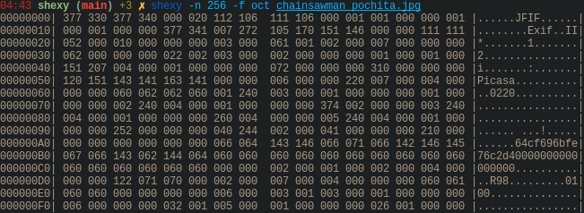

# Shexy
### \_(:3」∠)\_ The sexy hexdump \_(┐「ε:)\_

---

[Español](readmes/README-es.md) | [Portugês](readmes/README-pt.md) | [日本語](readmes/README-jp.md)

Shexy is a hexdump written in C.

## Examples:

Normal output:

Now with color:

Shexy also reads from the stream:

And it can show other formats:

It can use these formats:
- b, bin, binary
- o, oct, octal 
- d, dec, decimal
- h, hex, hexadecimal
