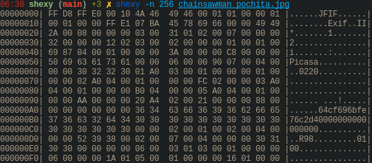

# Shexy
### The sexy hexdump \_(:3」∠)\_

---

[Español](readmes/README-es.md) | [Portugês](readmes/README-pt.md) | [日本語](readmes/README-jp.md)

Shexy is a data viewer written in C.

## Examples:

Normal output:

Now with color:

Shexy also reads from stream:

And you can print the data in other formats:

You can use these formats:
- b, bin, binary
- o, oct, octal 
- d, dec, decimal
- h, hex, hexadecimal
