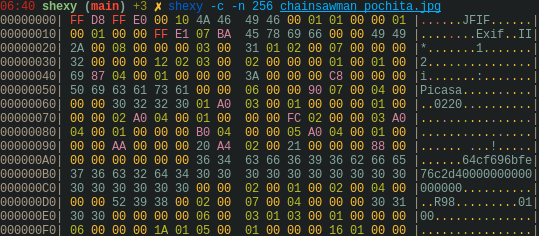
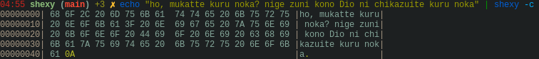

# Shexy
### セクシーなヘックスダンプ　\_(:3」∠)\_

---

[English](../README.md) | [Español](README-es.md) | [Portugês](README-pt.md)

ShexyはCで書かれたヘックスダンプ。

## 例：

普通の出力：

今、カラフルな出力:

Shexyもストリームから読めます:

そして、色々なフォーマットは見さられます。

次のフォーマットは使えます：
- b, bin, binary
- o, oct, octal 
- d, dec, decimal
- h, hex, hexadecimal
